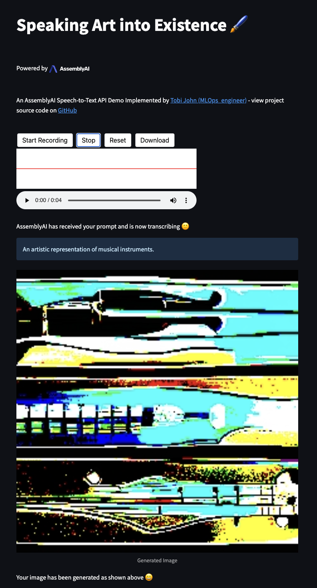

# AssemblyAI
AssemblyAI is a deep learning company focused on state-of-the-art models integrated into API's for audio and video transcription, speech synthesis, and natural language processing. Their APIs are designed to be easy to use and deploy. For more information, please visit [assemblyai.com](https://www.assemblyai.com/), you can also easily get started with AssemblyAI with a free account [here](https://app.assemblyai.com/). One of their widely used API's is their speech to text API. 

## Speaking art into existence :paintbrush: 
### An AssemblyAI Speech-to-Text API Demo Implemented by [Tobi John (MLOps_engineer)](https://twitter.com/MLOps_engineer)
This project is based off an astonishing post by [Ryan O'Connor](https://www.linkedin.com/in/ryan-s-oconnor/), a Developer Educator for Machine Learning at AssemblyAI, on how DALLE2 works. You can find the original post [here](https://www.assemblyai.com/blog/how-dall-e-2-actually-works/). I highly recommend you to read it before going through this project.

From the original post, it can be summarized that: "DALL-E 2 can generate semantically plausible photorealistic images given a text prompt, and can produce images with specific artistic styles, can produce variations of the same salient features represented in different ways, and can modify existing images"

While DALLE-2 has been used to generate images from text, it can also be used to generate text from audio data, leveraging on AssemblyAI's speech-to-text API. This is what we will be doing in this project.

## Dependencies
The required dependencies can be found in the `requirements.txt` file. You can install them by running the following command:

```bash
pip install -r requirements.txt
```
Most importantly, you will require your API key from AssemblyAI, and need streamlit and jinaai installed.
```bash
pip install streamlit
pip install jina
```

# Functions
This project contains 5 building functions and one main function. The functions are as follows:
- `record_audio()`: This function is used to get the audio file from the user. It uses streamlit to create a file uploader widget.
- `assemblyai_upload()`: This function is used to upload the audio file to AssemblyAI's speech-to-text API. It returns the transcript of the audio file.
- `transcribe()`: This function is used to transcribe the audio file. It uses the `record_audio()` and `assemblyai_upload()` functions to get the transcript of the audio file.
- `get_transcription_results()`: This function is used to get the transcription results from the user as a prompt for the DALL-E model.
- `call_dalle()`: This function is used to call the DALL-E model. It uses the `get_transcription_results()` function to get the prompt for the DALL-E model.
- `main()`: This is the main function which is used to run the entire project. It runs each function accordingly using the `transcribe()` and `get_transcription_results()` functions to get the transcription results and prompt for the DALL-E model.

Note: An input.wav file is provided in the repository for testing purposes which gets updated every time the `record_audio()` function is called i.e a user records themselves. For my love for music, my audio file says "an artistic impression of several musical instruments"

# Running the project
To run the project, you can run the following command:
```bash
streamlit run speakart.py
```




## What is Streamlit?
Streamlit is an open-source Python library that makes it easy to create and deploy custom web apps. It is very easy to use and is very powerful. You can find the documentation [here](https://docs.streamlit.io/en/stable/)

## Jina AI
Jina AI is an open-source MLOps framework that allows you to build cross-modal and multi-modal applications on the cloud. With their [CLIP-as-a-service](https://clip-as-service.jina.ai/) product, they provide free access to DALL·E Flow, an interactive workflow for generating high-definition images from text prompt leveraging on [DALL·E-Mega](https://github.com/borisdayma/dalle-mini), GLID-3 XL, and Stable Diffusion.You can find the documentation [here](https://github.com/jina-ai/dalle-flow/)

## Storing your API key
A standard and safe way to store your API key is by:
```bash
echo "export ASSEMBLY_API_KEY='yourkey'" >> ~/.zshrc
source ~/.zshrc
echo $ASSEMBLY_API_KEY
```
or you can use the following command to store your API key in a .env file:
```bash
echo "export ASSEMBLY_API_KEY='yourkey'" >> ~/.bash_profile
```

where 'yourkey' is your API key. And '~/.bash_profile' loads the key into your environment.

## Conclusion
Speak your art!